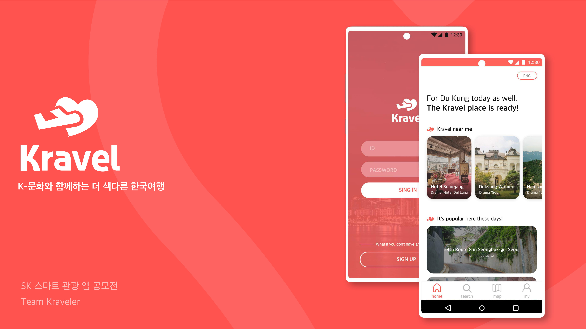
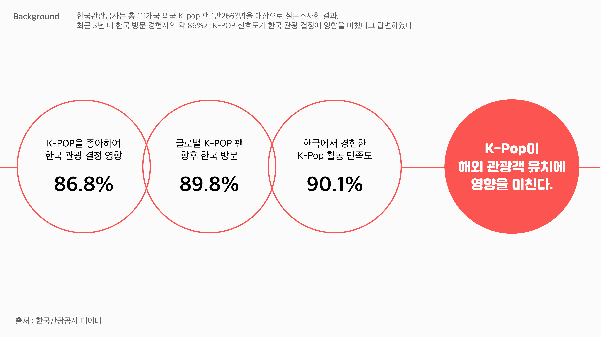
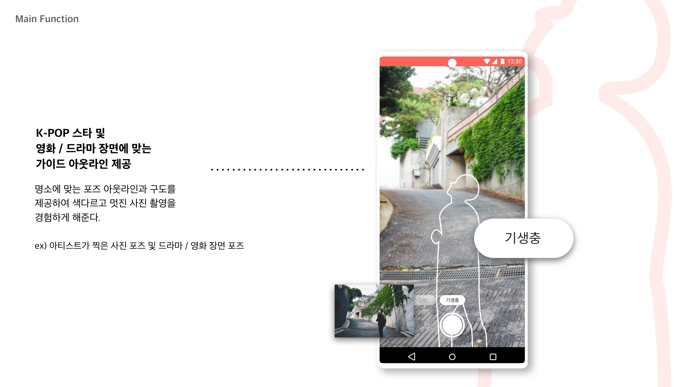
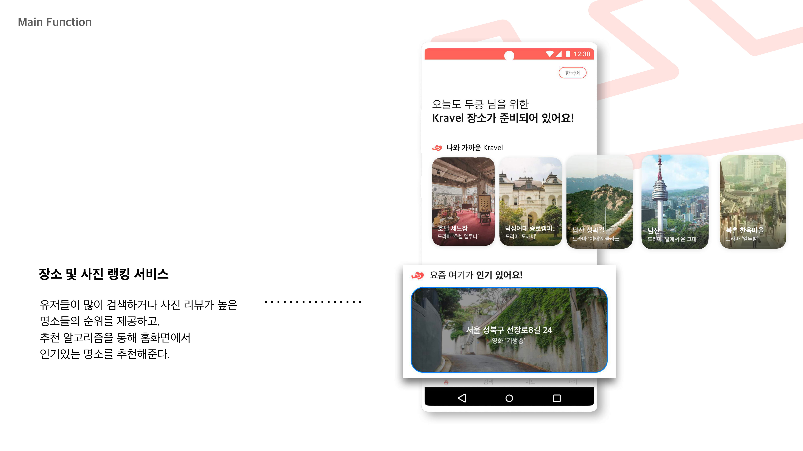
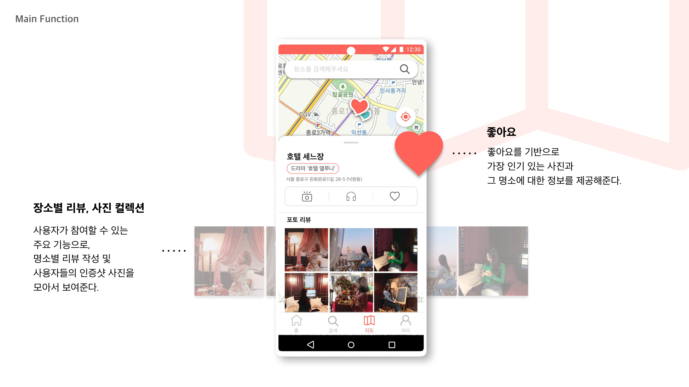

# Kravel
2020 SK 관광 앱 공모전- K문화와 함께하는 색다른 한국여행

### 외국어 앱 특별상 수상


### Using Tech
* Spring Boot(Spring Security, JWT, JPA)
* MariaDB
* AWS(EC2, RDS, EBS)
* Docker
* Swagger2

### Database ERD


### Necessary
> aws.yml
```yaml
cloud:
  aws:
    credentials:
      accessKey: ACCESS_KEY
      secretKey: SECRET_KEY
    s3:
      bucket: BUCKET
    region: REGION
```

> database.yml
```yaml
# Dev
spring:
  datasource:
    driver-class-name: org.mariadb.jdbc.Driver
    url: jdbc:mariadb://<DATABASE_URL>:<PORT>/kravel?serverTimezone=UTC&autoReconnect=true
    username: USER_NAME
    password: PASSWORD
  jpa:
    hibernate:
      ddl-auto: none
    properties:
      hibernate:
        default_batch_fetch_size: 100
        show_sql: true
        format_sql: true

logging:
  level:
    org.hibernate.SQL: debug
```
> key.yml
```yaml
keys:
  jwt:
    secret-key: JWT_SECRET_KEY
```

---

\
[]()








